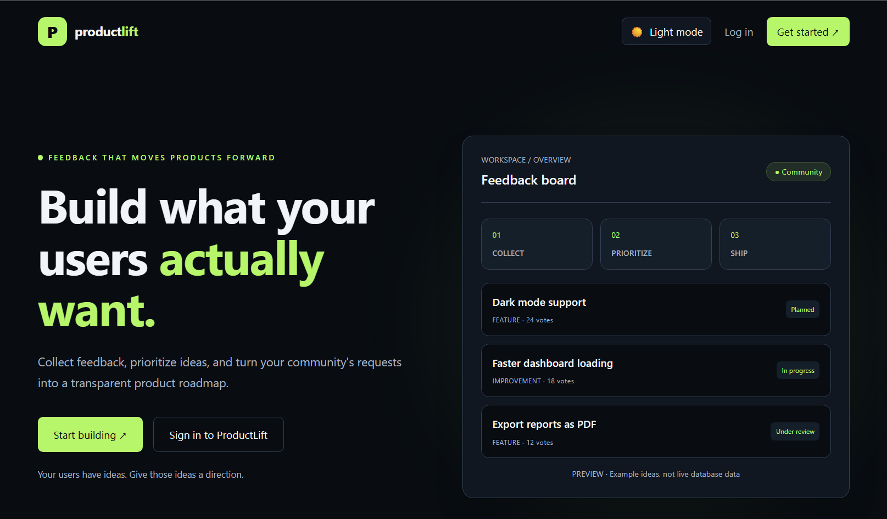
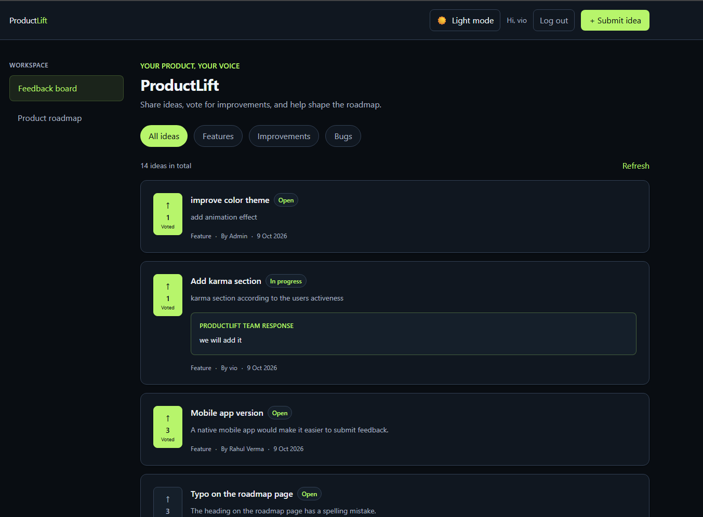
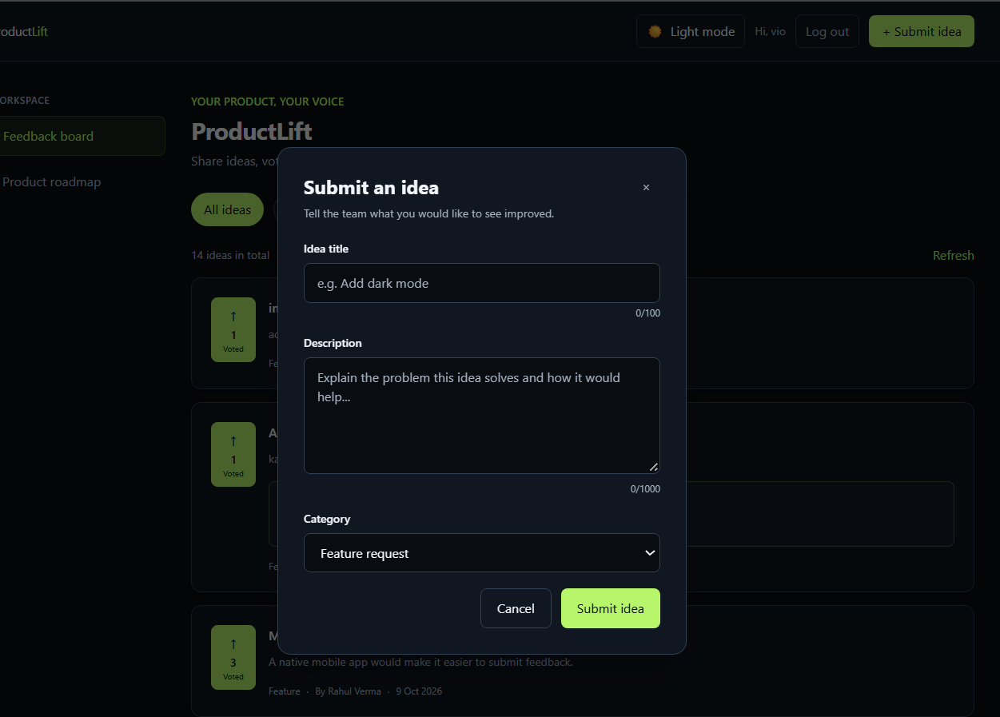
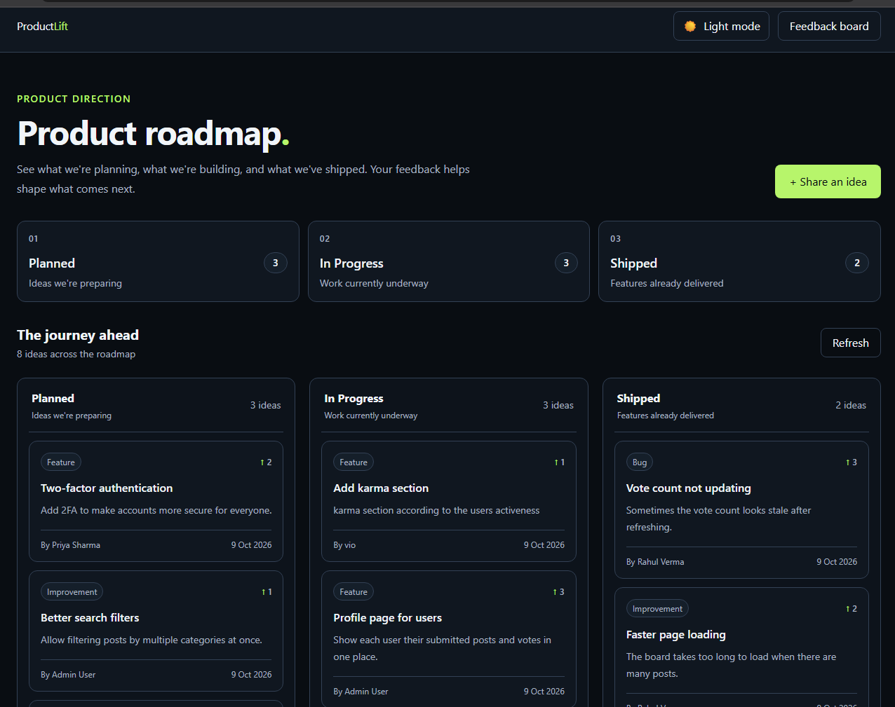
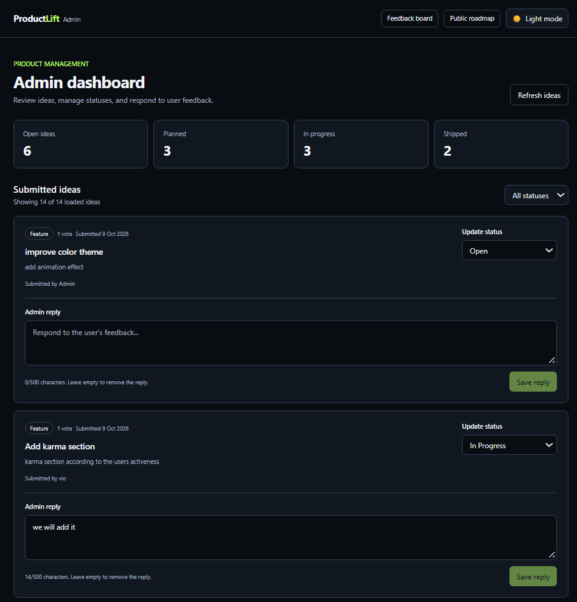
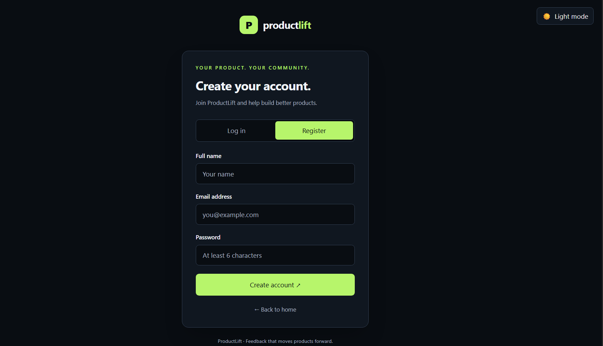
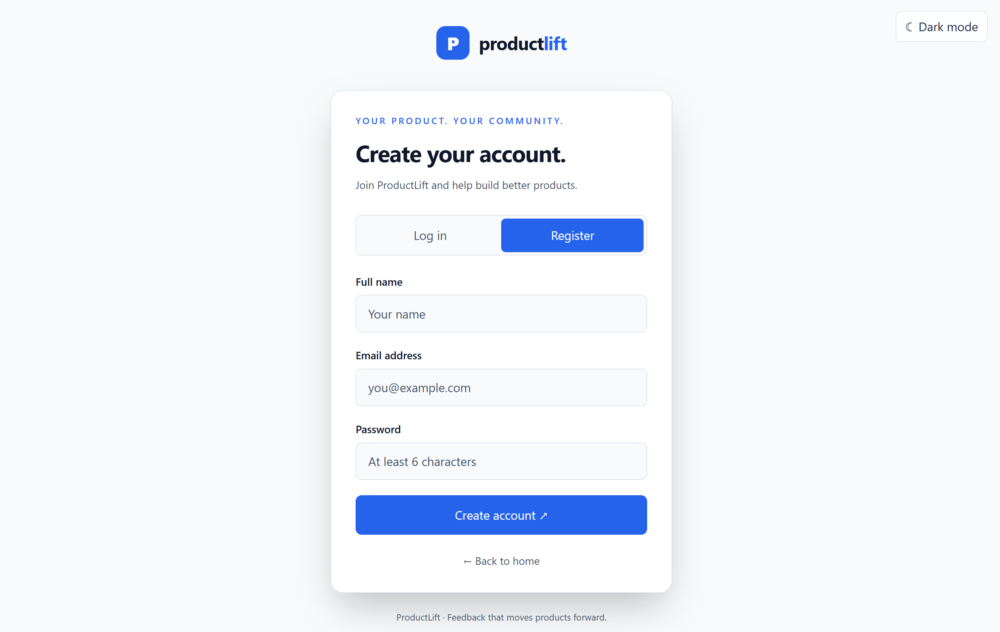
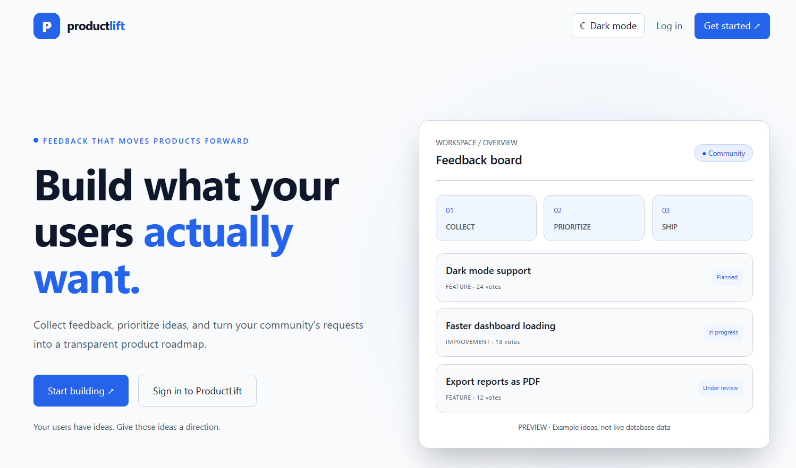
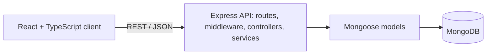

# ProductLift — Feedback & Roadmap Board

ProductLift is a full-stack **MERN + TypeScript** application where users submit product ideas, vote on the ones they care about, and follow progress on a public roadmap. Admins review feedback, move ideas through a status workflow and reply to users.

Built for the **Software Engineer Intern (MERN Stack)** technical assessment at StartupMeu.

<p align="center">
  
</p>

## Table of Contents

- [Features](#features)
- [Screenshots](#screenshots)
- [Tech Stack](#tech-stack)
- [Project Structure](#project-structure)
- [Architecture and Design](#architecture-and-design)
- [Getting Started](#getting-started)
- [Demo Accounts](#demo-accounts)
- [API Overview](#api-overview)
- [Design Decisions](#design-decisions)
- [Testing](#testing)
- [AI Development Experience](#ai-development-experience)
- [Future Improvements](#future-improvements)

## Features

### For users
- **Authentication:** register and log in with JWT-based sessions.
- **Submit ideas:** title (up to 100 characters), description (up to 1000 characters) and a category: Feature, Improvement or Bug.
- **Vote:** one vote per user per idea, and clicking again removes the vote.
- **Browse and filter:** view all ideas or filter by category.
- **Team responses:** admin replies appear directly on the idea card.
- **Public roadmap:** ideas grouped into Planned, In Progress and Shipped, with a count for each stage.
- **Light and dark themes** with a toggle on every page.

### For admins
- **Role-based access:** admin-only routes are enforced on the backend, not just hidden in the UI.
- **Admin dashboard:** summary counts for Open, Planned, In Progress and Shipped ideas.
- **Status management:** move any idea through Open → Planned → In Progress → Shipped.
- **Admin replies:** write, edit or remove a reply (up to 500 characters) on each idea.
- **Status filter** to focus on the ideas that need attention.

### Backend quality
- Request validation with **zod** on every write endpoint, with consistent JSON error responses.
- Pagination, search and sorting (newest or top voted) on the ideas API.
- Atomic voting backed by a unique index, so double-click and race conditions cannot create duplicate votes.
- Passwords hashed with bcrypt, and `helmet`, CORS restriction and rate limiting on the login and register routes.

## Screenshots

| Feedback board | Submit an idea |
| --- | --- |
|  |  |

| Public roadmap | Admin dashboard |
| --- | --- |
|  |  |

| Register (dark) | Register (light) |
| --- | --- |
|  |  |

<details>
<summary>Landing page in light mode</summary>



</details>

## Tech Stack

| Layer | Technologies |
| --- | --- |
| Frontend | React, TypeScript, Vite, Tailwind CSS, React Router |
| Backend | Node.js, Express, TypeScript |
| Database | MongoDB with Mongoose |
| Auth and security | JWT, bcryptjs, helmet, CORS, express-rate-limit |
| Validation | zod |
| Tools | Git and GitHub, Postman, Kiro (AI-assisted development) |

## Project Structure

```text
ProductLift/
├── client/                  # React + TypeScript frontend (Vite)
│   ├── src/
│   │   ├── pages/           # Landing, auth, board, roadmap, admin
│   │   ├── App.tsx          # Routing
│   │   └── ...
│   └── package.json
├── server/                  # Express + TypeScript API
│   ├── src/
│   │   ├── config/          # Environment validation and DB connection
│   │   ├── models/          # Mongoose models: User, Post, Vote
│   │   ├── schemas/         # zod validation schemas
│   │   ├── routes/          # Route definitions
│   │   ├── controllers/     # Thin HTTP handlers
│   │   ├── services/        # Business logic (auth, posts, votes)
│   │   ├── middleware/      # auth, adminOnly, validate, errorHandler, notFound
│   │   ├── utils/           # JWT, AppError, asyncHandler, seed script
│   │   ├── app.ts           # Express app (testable without opening a port)
│   │   └── server.ts        # Entry point
│   └── package.json
├── .agents/                 # AI agent task files from development
└── README.md
```

The backend follows a **routes → controllers → services → models** layering: routes declare endpoints and middleware, controllers translate HTTP to function calls, and services hold the business rules.

## Architecture and Design

The system design is documented with UML and architecture diagrams in [`docs/ARCHITECTURE.md`](docs/ARCHITECTURE.md): system architecture, use cases, ER diagram, class diagram, sequence diagrams (login, voting, admin status update), the post status lifecycle and the main design decisions.



## Getting Started

### Prerequisites

- Node.js 18 or newer and npm
- A MongoDB database: local MongoDB or a free [MongoDB Atlas](https://www.mongodb.com/atlas) cluster
- Git

### 1. Clone the repository

```bash
git clone https://github.com/tecnicoviola/ProductLift.git
cd ProductLift
```

### 2. Set up the backend

```bash
cd server
npm install
```

Create `server/.env`:

```env
PORT=5000
NODE_ENV=development
MONGO_URI=mongodb://127.0.0.1:27017/productlift
JWT_SECRET=replace-with-a-random-string-of-at-least-32-characters
CLIENT_URL=http://localhost:5173
```

| Variable | Purpose |
| --- | --- |
| `PORT` | Port the API listens on |
| `NODE_ENV` | `development` or `production` |
| `MONGO_URI` | MongoDB connection string |
| `JWT_SECRET` | Secret used to sign tokens, at least 32 characters |
| `CLIENT_URL` | Full URL of the frontend, used for the CORS allow-list |

> Never commit your real `.env` file. It is listed in `.gitignore`.

Optionally load demo data (see the warning below), then start the API:

```bash
npm run seed
npm run dev
```

You should see `MongoDB connected` and `Server running on port 5000`. Check it at `http://localhost:5000/api/health`.

> **Warning:** `npm run seed` deletes all users, posts and votes in the database that `MONGO_URI` points to. Only run it against a development database.

### 3. Set up the frontend

Open a second terminal:

```bash
cd client
npm install
npm run dev
```

Create `client/.env` if your setup needs to point to a different API address:

```env
VITE_API_URL=http://localhost:5000/api
```

Open the URL printed by Vite, usually `http://localhost:5173`. Keep both servers running while you use the app.

### Other useful scripts

| Where | Command | What it does |
| --- | --- | --- |
| `server` | `npm run typecheck` | Type-check the backend without emitting files |
| `server` | `npm run seed` | Reset and fill the database with demo data |
| `client` | `npm run build` | Create a production build of the frontend |

## Demo Accounts

After running `npm run seed`, you can sign in with these local demo accounts:

| Role | Email | Password |
| --- | --- | --- |
| Admin | `admin@feedbackboard.com` | `Admin123!` |
| User | `priya@example.com` | `User123!` |
| User | `rahul@example.com` | `User123!` |

These credentials exist only in the seed script for local development. Registration always creates a normal `user` account, and the role cannot be chosen by the client.

## API Overview

Base URL: `http://localhost:5000/api`. Every response includes `success: true | false`. Errors use the shape `{ success: false, message, errors? }`.

| Method | Endpoint | Access | Description |
| --- | --- | --- | --- |
| GET | `/health` | Public | Health check |
| POST | `/auth/register` | Public | Create an account and receive a token |
| POST | `/auth/login` | Public | Log in and receive a token |
| GET | `/auth/me` | User | Current user |
| GET | `/posts` | Public | List ideas. Supports `category`, `status`, `search`, `sort`, `page` and `limit`. Adds `hasVoted` when a valid token is sent |
| GET | `/posts/:id` | Public | Get one idea |
| POST | `/posts` | User | Create an idea |
| PUT | `/posts/:id` | Author | Edit your own idea |
| DELETE | `/posts/:id` | Author or admin | Delete an idea and its votes |
| POST | `/posts/:id/vote` | User | Toggle your vote |
| PATCH | `/posts/:id/status` | Admin | Update status and the admin reply |
| GET | `/roadmap` | Public | Ideas grouped into planned, in progress and shipped |

**Categories:** `feature`, `improvement`, `bug`. **Statuses:** `open`, `planned`, `in-progress`, `shipped`.

## Design Decisions

- **Votes are separate documents.** A `Vote` collection with a unique `(user, post)` index guarantees one vote per user. The post's `voteCount` is only changed after a vote is really created or deleted, so the two cannot drift apart.
- **No N+1 queries.** `hasVoted` for a whole page of ideas is resolved with a single query and a lookup set.
- **Roles are never trusted from the client.** The registration schema drops unknown fields, and the role is set on the server.
- **Public endpoints expose only the author's name,** never their email.
- **Same error for unknown email and wrong password,** so the login endpoint cannot be used to discover registered emails.
- **The Express app is separate from the server start-up** (`app.ts` vs `server.ts`) so it can be tested without opening a port.
- **User input in search is escaped** before it is used in a regular expression.

## Testing

The API was verified with Postman against these scenarios: health check, validation errors (bad sort value, invalid ids), registration and duplicate-email handling, login, `hasVoted` for logged-in users, vote toggling, admin-only status updates (403 for normal users) and roadmap grouping. Both the client and server type-check cleanly with TypeScript. Automated test suites are listed under future improvements.

## AI Development Experience

**Tool used for the assessment: Kiro.** I used Kiro as my main AI development tool, and other AI assistants for planning and troubleshooting. I reviewed the generated code and tested it myself before committing it.

### Where I used Kiro

| # | Task | What I asked the AI to do | Problem I found and how I fixed it |
| --- | --- | --- | --- |
| 1 | Initial project and agent setup | _[ used Kiro during the initial setup of ProductLift to help establish the project structure and create the .agents folder for organizing AI-assisted development workflows.]_ | _[ reviewed the generated project structure and checked that the files and folders matched the requirements of the application. I adjusted the structure where needed as development progressed.]_ |
| 2 | Backend implementation | _[I have made the structure of the code I used AI assistance during backend development to help implement the codes of application's routes, controllers, and Mongoose models for users, feedback posts, and votes.]_ | _[ checked that the routes, controllers, and models worked together correctly. When an API operation did not behave as expected, I traced the request flow and verified the route, middleware, controller logic, and database operation.]_ |
| 3 | Database and API integration | _[I connect the backend to MongoDB and implement API operations for retrieving feedback posts, I used AI for submitting feedback, voting, and retrieving roadmap data.]_ | _[I tested the API integration and verified that feedback data loaded from MongoDB. I also checked that creating feedback required authentication and that the frontend displayed the returned data correctly.]_ |
| 4 | Frontend components | _[I used Kiro to develop and refine React components for the feedback board, roadmap page, login flow, admin dashboard, protected routes, and theme toggle.]_ | _[I tested the navigation and user flows, including protected pages and admin functionality. I verified that admin status updates and replies were reflected on the feedback board and checked that category filtering worked.]_ |
| 5 | Debugging and refactoring | _[I used Kiro to investigate errors, understand TypeScript, and refine code across the React frontend and Express backend.]_ | _[I ran the relevant checks, examined error messages, and tested the affected functionality after changes. I used the results to identify integration issues and verify that the application continued to work as expected.]_ |

### How I worked with the AI

- I gave the AI small, specific tasks instead of one large request, and tested each result before moving on.
- I read every generated file before committing it and fixed the places where it was wrong or incomplete.
- I used other AI assistants for planning, explanations and troubleshooting. All code in this repository is code I reviewed and can explain.

## Future Improvements

- Automated tests (API tests with Jest or Vitest and Supertest, component tests with React Testing Library)
- Comment threads on ideas
- Email notifications when an idea changes status
- Deployment (frontend on Vercel, backend on Render, database on MongoDB Atlas)
- Duplicate-idea detection and idea merging for admins

## Author

Built by [@tecnicoviola](https://github.com/tecnicoviola).
