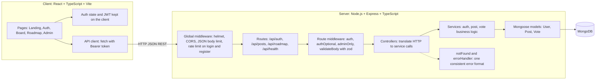
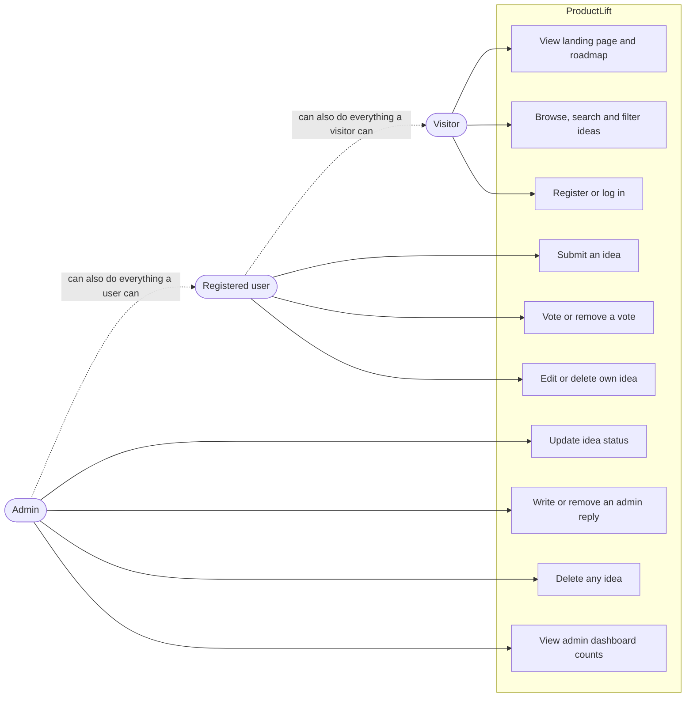
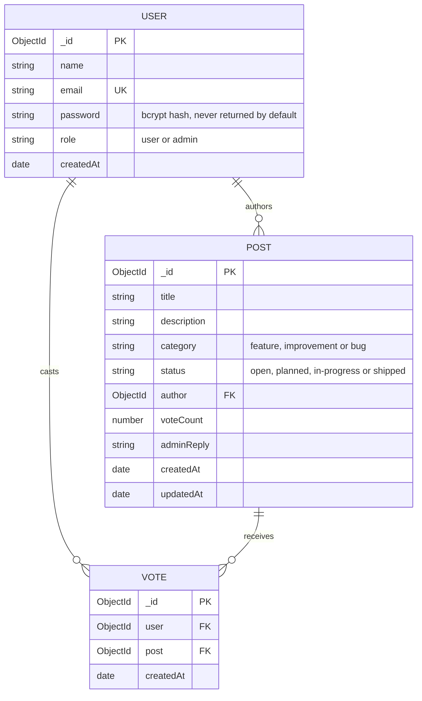
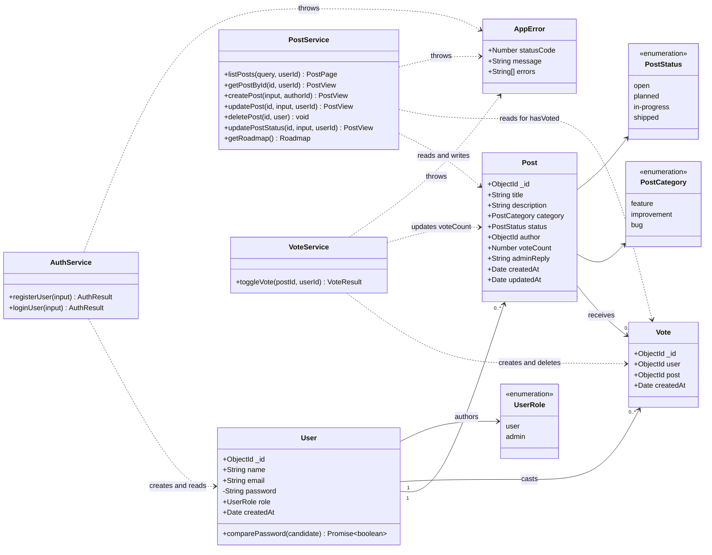
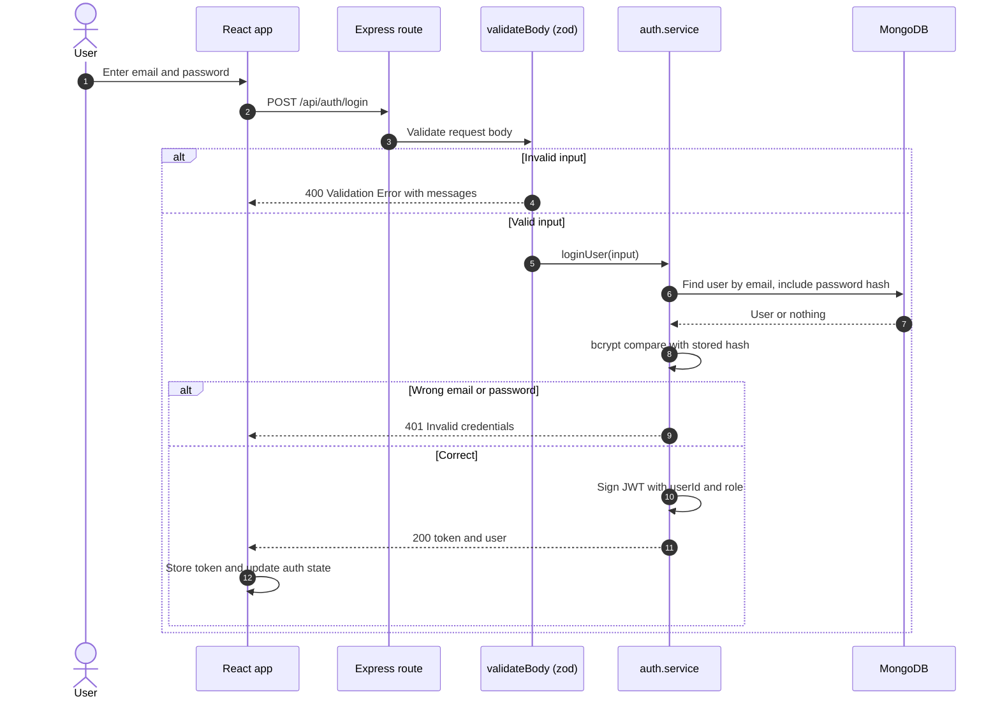
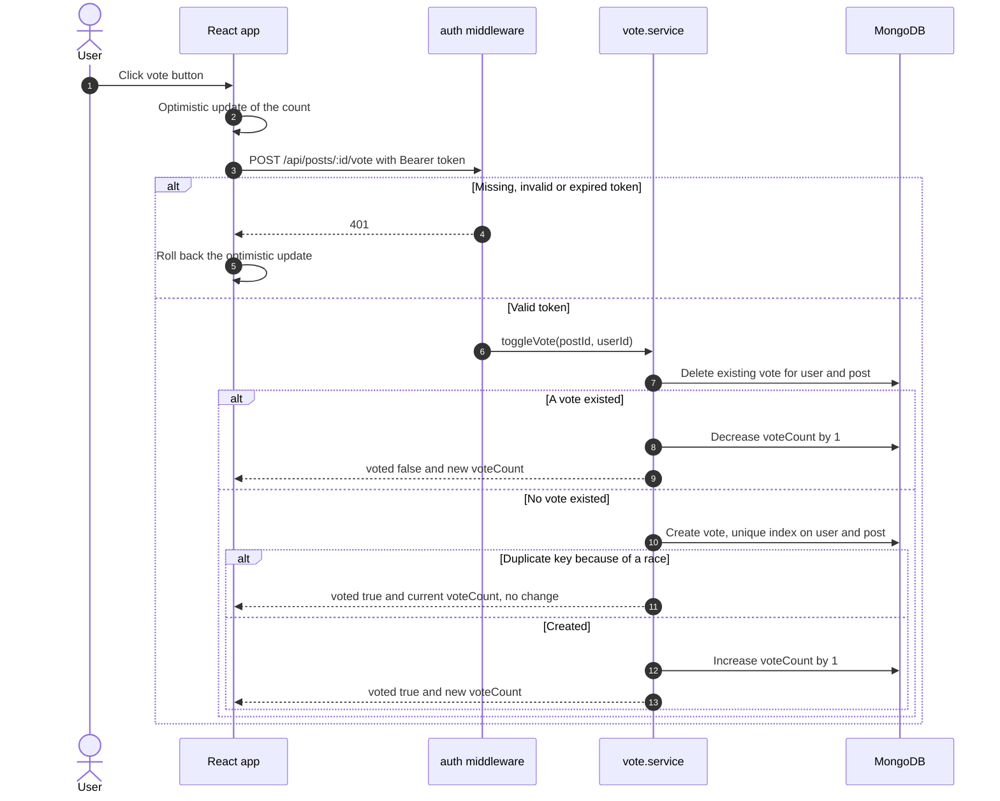
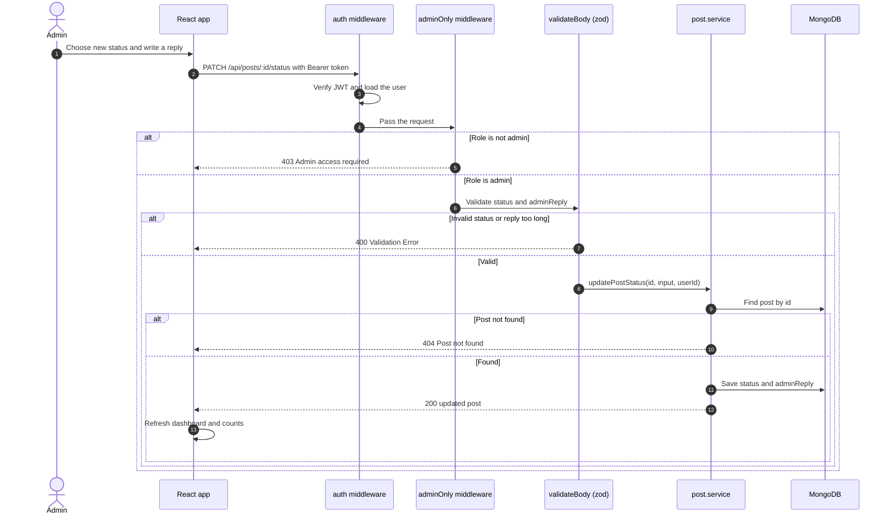
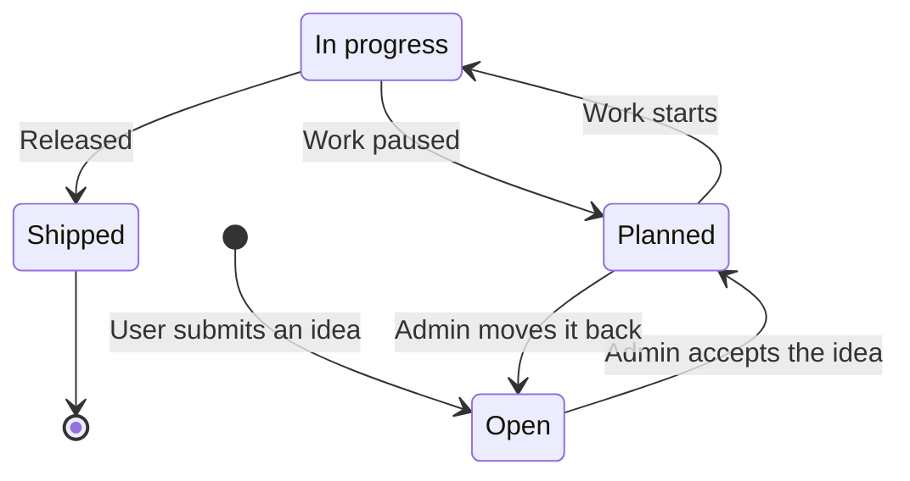
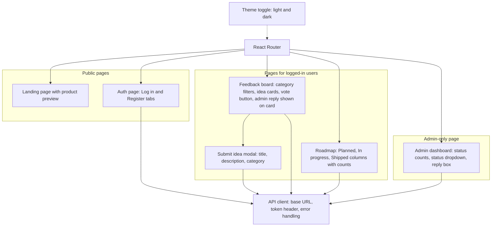
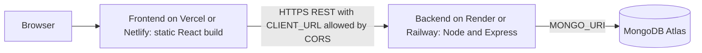

# ProductLift: Architecture and UML Design

This document describes how ProductLift is designed: the system architecture, use cases, data model, class structure, key interaction flows and the post status lifecycle. All diagrams are written in [Mermaid](https://mermaid.js.org/), so GitHub renders them directly in this file.

## Contents

1. [System architecture](#1-system-architecture)
2. [Use case diagram](#2-use-case-diagram)
3. [Data model (ER diagram)](#3-data-model-er-diagram)
4. [Backend class diagram](#4-backend-class-diagram)
5. [Sequence diagrams](#5-sequence-diagrams)
6. [Post status lifecycle](#6-post-status-lifecycle)
7. [Frontend structure](#7-frontend-structure)
8. [Planned deployment](#8-planned-deployment)
9. [Key design decisions](#9-key-design-decisions)

---

## 1. System architecture

ProductLift is a three-tier application: a React single-page app talks to a REST API built with Express, which stores data in MongoDB. The backend is layered so that each part has one job.

### Layer responsibilities

| Layer | Responsibility |
| --- | --- |
| Routes | Declare endpoints and attach middleware. No logic. |
| Middleware | Authentication, role check, input validation, error handling. |
| Controllers | Read the request, call a service, send the response. |
| Services | Business rules: who may edit a post, how a vote toggles, how the roadmap is grouped. |
| Models | Schema, indexes and persistence through Mongoose. |

`app.ts` builds the Express app and `server.ts` starts it, so the app can be tested without opening a port.

---

## 2. Use case diagram

Three kinds of actors use the system. An admin can do everything a registered user can, and a registered user can do everything a visitor can.

Reading ideas and the roadmap is public at the API level. Everything that changes data requires a valid token, and status changes, admin replies and deleting other people's ideas require the admin role.

---

## 3. Data model (ER diagram)

Three MongoDB collections. `Vote` is its own collection so a unique index can guarantee one vote per user per post.

**Indexes and constraints**

- `User.email` is unique and stored in lower case.
- `Vote` has a unique compound index on `(user, post)`. This is what prevents duplicate votes, even if two requests arrive at the same moment.
- `Post.voteCount` is a stored counter so that sorting by top voted does not need an aggregation.

---

## 4. Backend class diagram

The domain models and the services that operate on them.

---

## 5. Sequence diagrams

### 5.1 Login

The same message is returned for an unknown email and a wrong password, so the endpoint cannot be used to find out which emails are registered.

### 5.2 Vote toggle

Votes are stored as documents first. The counter only changes after a vote has really been created or deleted, so the two cannot drift apart.

### 5.3 Admin updates status and replies

---

## 6. Post status lifecycle

A post starts as Open. The normal path moves forward through Planned and In progress to Shipped. The API accepts any valid status from an admin, so an idea can also be moved back, for example if work is paused.

Only Planned, In progress and Shipped ideas appear on the public roadmap. Open ideas stay on the feedback board only.

---

## 7. Frontend structure

A page-level view of the React app. Component names inside each page are described by what the user sees.

The frontend hides pages the user may not open, but the real protection is on the server: every restricted endpoint checks the token and role again.

---

## 8. Planned deployment

This is the intended production setup. It is not deployed yet.

Secrets (`MONGO_URI`, `JWT_SECRET`) live in the hosting provider's environment settings, never in the repository.

---

## 9. Key design decisions

| Decision | Reason |
| --- | --- |
| Layered backend (routes, controllers, services, models) | Keeps HTTP handling separate from business rules, so logic can be changed and tested on its own. |
| Separate `Vote` collection with a unique `(user, post)` index | The database itself guarantees one vote per user, even under concurrent requests. |
| Stored `voteCount` on `Post` | Sorting by top voted stays a simple indexed query. |
| zod validation in middleware | Bad input is rejected early, and unknown fields such as a `role` sent to `/register` are dropped. |
| Role set on the server | Nobody can make themselves an admin through the API. |
| `authOptional` on public reads | Anonymous visitors can browse, and logged-in users also get `hasVoted` without a second request. |
| One query for `hasVoted` per page of posts | Avoids the N+1 query problem. |
| Central `errorHandler` and `AppError` | Every error has the same JSON shape: `{ success: false, message, errors? }`. |
| Same error for unknown email and wrong password | Prevents discovering which emails are registered. |
| `helmet`, CORS allow-list and login rate limiting | Basic hardening against common web attacks and password guessing. |
