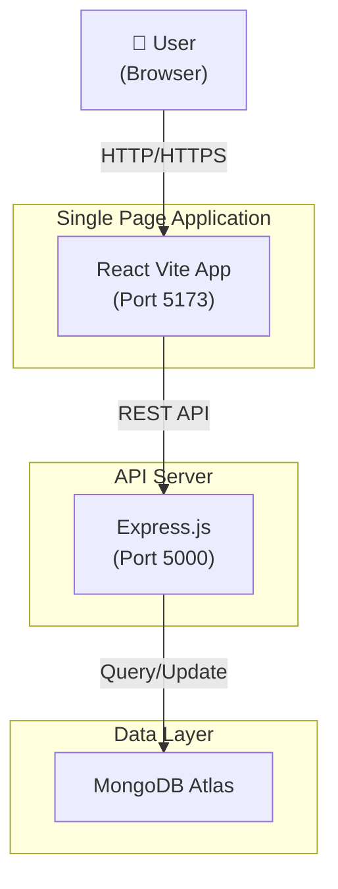
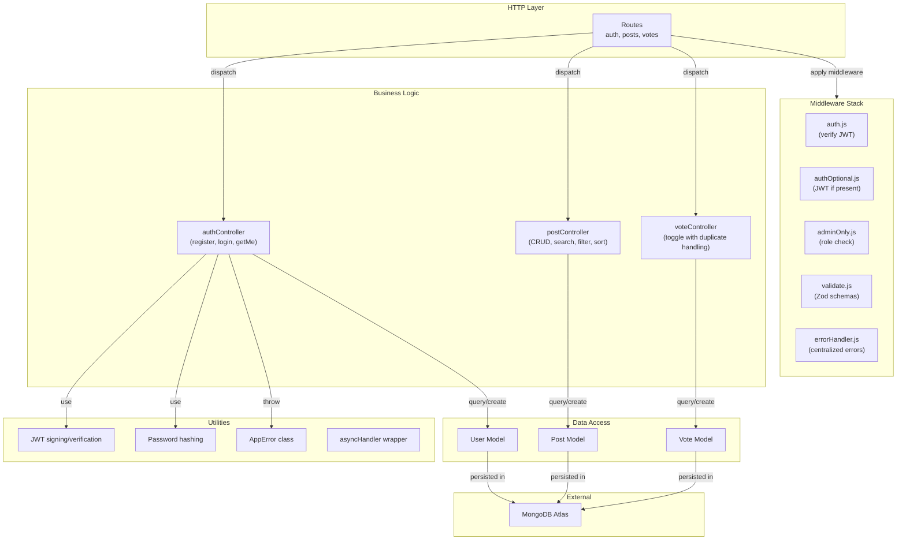
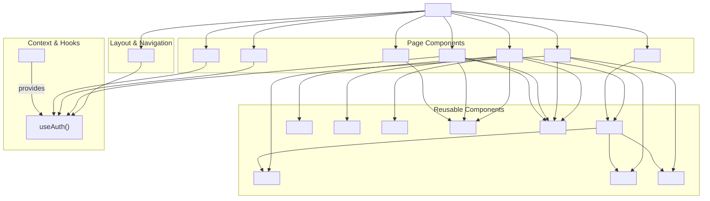
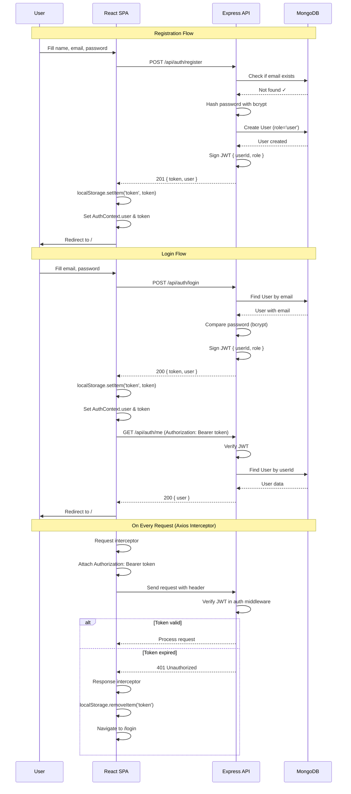
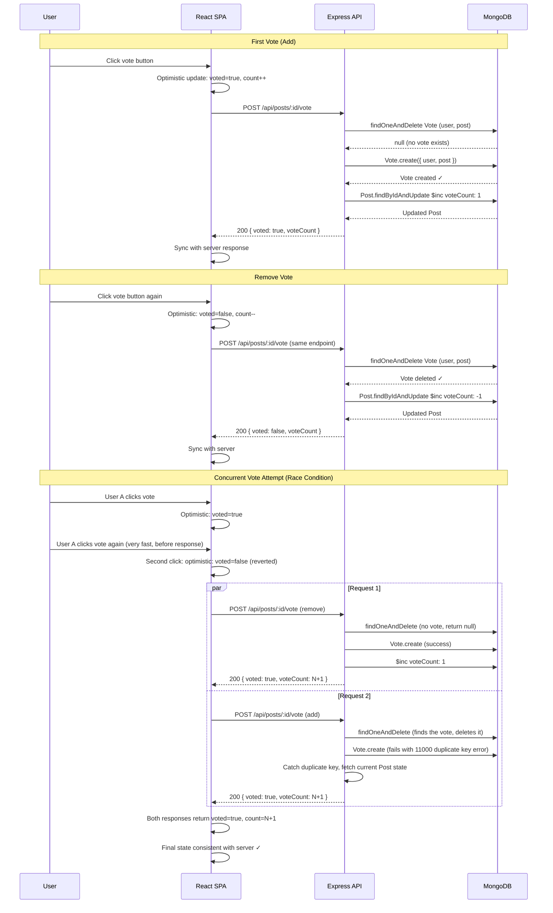
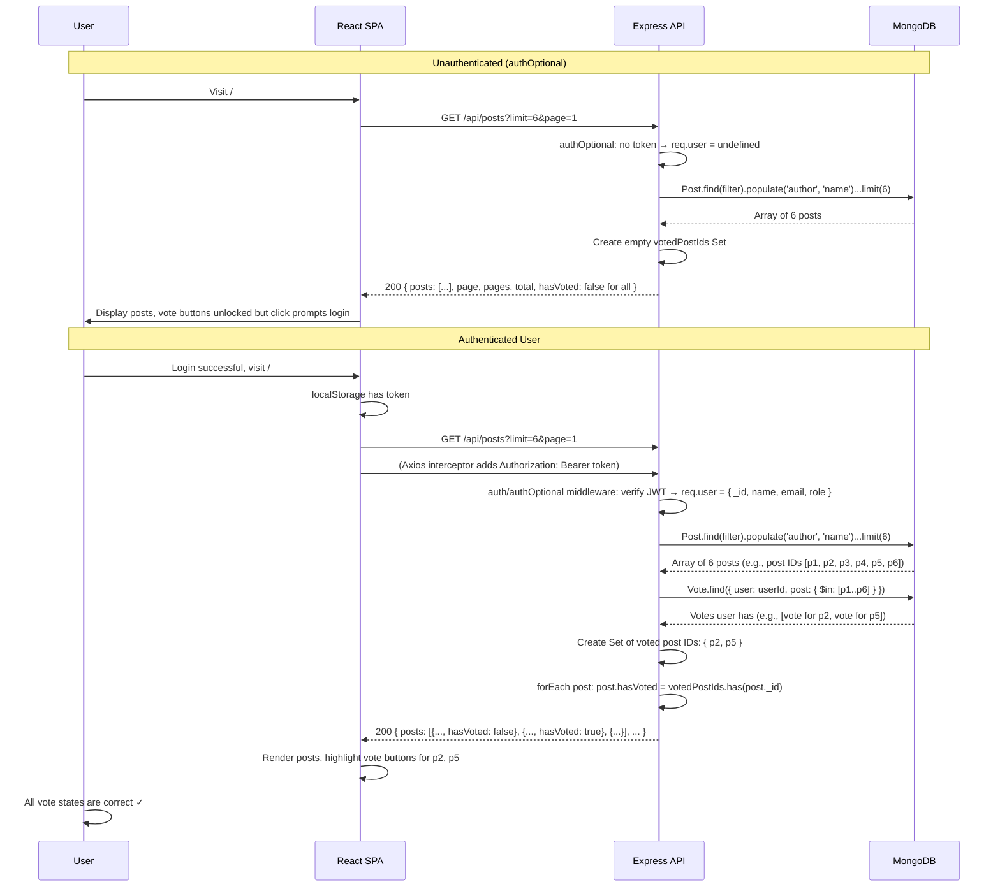
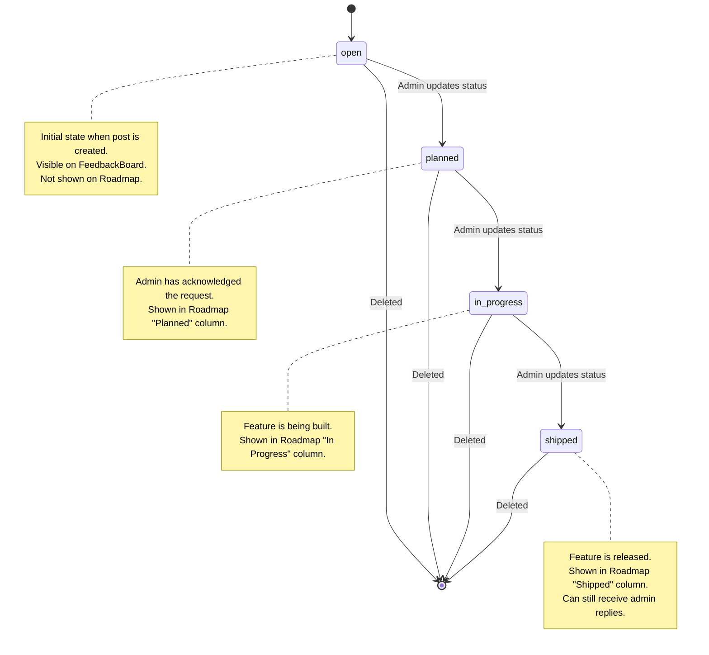

# Architecture Documentation

## System Context & Container View

## Layered Server Architecture

## Frontend Component Tree

## Sequence Diagram: Register & Login with JWT

## Sequence Diagram: Vote Toggle with Duplicate-Key Handling

## Sequence Diagram: List Posts with hasVoted Computation

## State Diagram: Post Status Flow

---

## Architecture Decisions

### 1. Separate Votes Collection vs. Array in Post

**Decision**: Separate `Vote` collection with compound unique index on `(user, post)`.

**Trade-offs**:
- **Pros**: Enables efficient "hasVoted" queries (single Vote lookup); scales well as post vote counts grow; no array size limits; simplifies concurrent vote operations
- **Cons**: Slightly higher latency for vote toggle (two operations: delete/create Vote, then $inc Post); additional collection to manage

**Rationale**: A FeedbackBoard expects thousands of votes over time. Storing votes as an array in Post would cause the document to grow indefinitely, degrading query performance and risking MongoDB's 16MB document limit. A separate collection with a compound index is the standard denormalization pattern for such scenarios.

### 2. Denormalized voteCount

**Decision**: Store `voteCount` as a denormalized field on Post, updated via `$inc` operator.

**Trade-offs**:
- **Pros**: Fast aggregation on FeedbackBoard (sorting by top is O(1) per document); avoids expensive `$size` or `$lookup` aggregation pipelines
- **Cons**: Potential for count drift if vote operations fail mid-transaction (though race condition handling mitigates this)

**Rationale**: The FeedbackBoard needs to sort and display posts by popularity without running an aggregation pipeline. Denormalization trades a small risk of eventual consistency for responsive UI performance.

### 3. JWT in localStorage vs. httpOnly Cookie

**Decision**: JWT stored in `localStorage`, attached to `Authorization: Bearer` header manually.

**Trade-offs**:
- **Pros**: Works seamlessly with CORS from separate frontend domain; CSRF attacks impossible (CORS controls same-origin requests); visible to frontend for client-side logic
- **Cons**: Vulnerable to XSS (malicious script in page can steal token); developers must manually attach headers; logout is client-side only

**Rationale**: This is a full-stack MERN app with separate frontend and backend domains (5173 vs. 5000). httpOnly cookies fail with CORS for cross-domain requests. localStorage + explicit header attachment is simpler to manage in this architecture. XSS risk is mitigated by input validation and avoiding dynamic HTML injection.

### 4. Offset Pagination vs. Cursor-Based

**Decision**: Offset-based pagination (page number + limit).

**Trade-offs**:
- **Pros**: Simple to implement; intuitive for users (page 1, 2, 3); easy to hardcode canonical URLs
- **Cons**: Skips can become expensive at high page numbers (though limit capped at 50); not suitable for real-time data where documents shift during pagination

**Rationale**: FeedbackBoard is not a high-frequency real-time feed. Offset pagination is sufficient for typical usage and simpler for UX. If this scales to 1M+ posts, cursor-based pagination should be reconsidered.

### 5. Regex Search vs. Text Index

**Decision**: Regex search on title and description fields.

**Trade-offs**:
- **Pros**: Works immediately without index setup; flexible for partial matches; case-insensitive with `$options: 'i'`
- **Cons**: Slower for large datasets (must scan all documents); not ideal for full-text search (doesn't understand word boundaries natively); regex escaping required to prevent injection

**Rationale**: Current dataset is expected to be under 10k posts. Regex search is acceptable for this scale. As data grows, creating a MongoDB text index (`db.posts.createIndex({ title: "text", description: "text" })`) would replace this without schema changes.

---

## Scaling and Future Work

### Phase 1: Current (MVP)
- Single backend instance
- MongoDB Atlas shared cluster
- In-memory session state
- Offset pagination

### Phase 2: Performance (Caching & Indexing)
- Redis for session caching and vote rate-limiting
- Text indexes on `title` and `description` for full-text search
- Composite indexes: `{ category: 1, status: 1, createdAt: -1 }` for filtered queries
- CDN for static assets
- Backend load balancing (nginx reverse proxy)

### Phase 3: Real-Time (WebSockets)
- Socket.io for live vote updates
- Push notifications when admin replies to user posts
- Real-time roadmap sync (multiple users viewing simultaneously)

### Phase 4: Analytics & Admin Dashboard
- Aggregation pipelines to compute trends (votes over time, top categories)
- Admin dashboard with charts: posts per category, vote distribution, user engagement
- Email digests for admins with weekly summary

### Phase 5: Advanced Features
- Image uploads (S3 or CloudFlare)
- Email notifications (SendGrid)
- Categories managed by admins (currently hardcoded)
- Tags/labels for posts (enable cross-category filtering)
- User profiles with post history
- Duplicate detection (similar posts flagged during creation)
